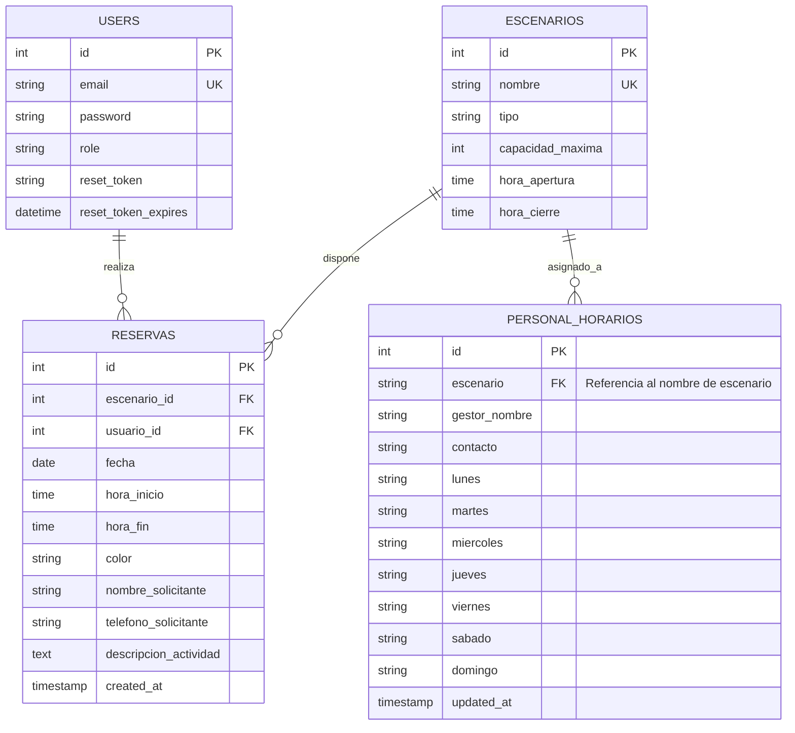

# Modelo de Datos - Proyecto PGD

Este documento describe la estructura de la base de datos `login_db`, las relaciones entre entidades y las restricciones de integridad aplicadas, cumpliendo con los requerimientos académicos de documentación técnica.

## 1. Diagrama Entidad-Relación (ERD)

## 2. Diccionario de Datos

### Tabla: `users`
Almacena la información de los usuarios del sistema y sus privilegios.
| Campo | Tipo | Descripción |
| :--- | :--- | :--- |
| `id` | INT | Llave primaria autoincremental. |
| `email` | VARCHAR(255) | Correo electrónico (único para login). |
| `password` | VARCHAR(255) | Hash de la contraseña (Bcrypt). |
| `role` | VARCHAR(50) | Rol del usuario (`admin`, `empleado`). |
| `reset_token` | VARCHAR(255) | Token temporal para recuperación de cuenta. |

### Tabla: `escenarios`
Catálogo de sedes y espacios deportivos administrados.
| Campo | Tipo | Descripción |
| :--- | :--- | :--- |
| `id` | INT | Llave primaria. |
| `nombre` | VARCHAR(255) | Nombre único de la sede deportia. |
| `tipo` | VARCHAR(50) | Clasificación (cancha, placa, pista, etc.). |

### Tabla: `reservas`
Registro de ocupación de los escenarios.
| Campo | Tipo | Descripción |
| :--- | :--- | :--- |
| `id` | INT | Llave primaria. |
| `escenario_id` | INT | Llave foránea (FK) a `escenarios`. |
| `usuario_id` | INT | Llave foránea (FK) a `users` (quien registra). |
| `nombre_solicitante` | VARCHAR(255) | Nombre de la entidad o persona que reserva. |

### Tabla: `personal_horarios`
Matriz de turnos semanales para los gestores en cada sede.
| Campo | Tipo | Descripción |
| :--- | :--- | :--- |
| `id` | INT | Llave primaria. |
| `escenario` | VARCHAR(255) | Nombre del escenario (Vinculado lógicamente). |
| `gestor_nombre` | VARCHAR(255) | Nombre del funcionario encargado. |

---

## 3. Integridad Referencial
- **ON DELETE CASCADE**: Si un usuario o un escenario es eliminado, sus reservas asociadas se eliminan automáticamente para evitar datos huérfanos.
- **UNIQUE Constraints**: Se garantiza que no existan correos duplicados ni nombres de escenarios repetidos.
- **Validación de Solapamiento**: El sistema valida en el backend que no existan dos reservas en el mismo bloque de tiempo para un mismo escenario.
