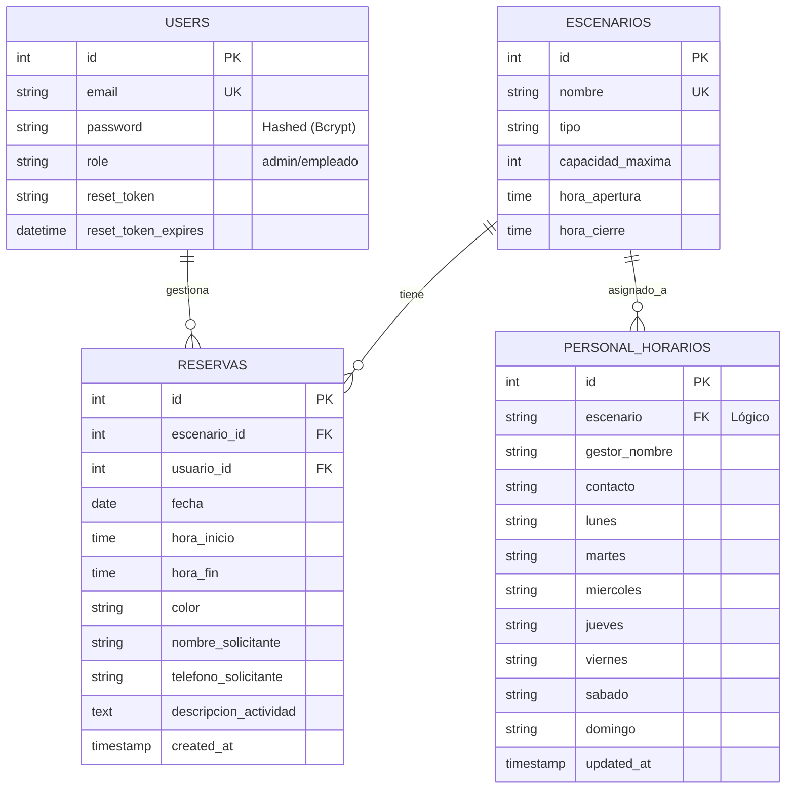

# Documentación de Base de Datos - Sistema PGD

Este documento unifica la información técnica sobre el modelo de datos `login_db`.

## 1. Diagrama Entidad-Relación (ERD)

## 2. Diccionario de Datos

### `users`
Almacena credenciales y roles de acceso.
| Campo | Tipo | Descripción |
| :--- | :--- | :--- |
| `id` | INT | Identificador único. |
| `email` | VARCHAR | Correo electrónico de acceso. |
| `role` | VARCHAR | Nivel de permiso (`admin` tiene acceso total). |

### `escenarios`
Catálogo maestro de las sedes deportivas.
| Campo | Tipo | Descripción |
| :--- | :--- | :--- |
| `id` | INT | ID único de la sede. |
| `nombre` | VARCHAR | Nombre oficial del escenario. |
| `tipo` | VARCHAR | Clasificación (Cancha, Pista, Coliseo, etc.). |

### `personal_horarios`
Matriz de programación de turnos para los gestores.
**Nota Importante:** Esta tabla define qué escenarios son visibles en el módulo `HorarioGestor`.
| Campo | Tipo | Descripción |
| :--- | :--- | :--- |
| `escenario` | VARCHAR | Nombre del escenario. Debe coincidir con registros oficiales. |
| `gestor_nombre` | VARCHAR | Nombre del funcionario. |
| `lunes`...`domingo` | VARCHAR | Turno asignado (ej: "6:00 1:30", "DESCANSO"). |

### `reservas`
Registro de ocupación de espacios.
| Campo | Tipo | Descripción |
| :--- | :--- | :--- |
| `escenario_id` | INT | Referencia a la tabla `escenarios`. |
| `nombre_solicitante` | VARCHAR | Persona o entidad que reserva. |
| `hora_inicio` / `fin` | TIME | Bloque de tiempo reservado. |

## 3. Notas de Integridad
*   **Gestión de Escenarios**: Para añadir un nuevo escenario al sistema de gestión de horarios, se debe insertar un registro en la tabla `personal_horarios`. Ver `MANUAL_ESCENARIOS.md`.
*   **Reservas**: El sistema valida solapamientos de horario en el backend antes de insertar.
